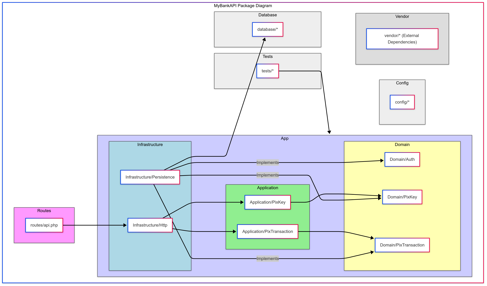
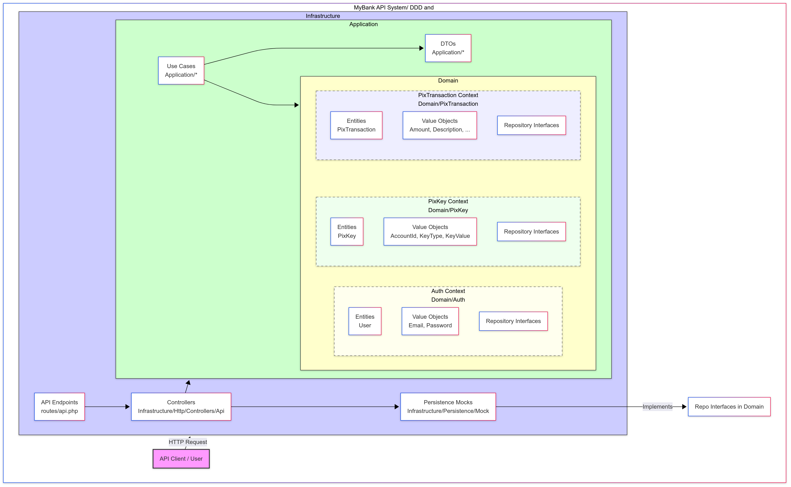
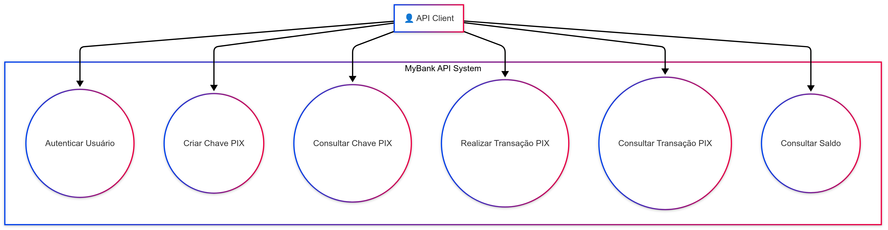

# Estruturação do Projeto - MyBankAPI

Este documento apresenta a estruturação técnica do projeto MyBankAPI, uma API bancária desenvolvida seguindo os princípios de Domain-Driven Design (DDD) e Clean Architecture com Laravel.

## Histórico Cronológico de Desenvolvimento

### 1. Estruturação Inicial do Projeto

O projeto foi inicialmente estruturado seguindo os princípios de DDD e Clean Architecture, com a separação clara entre as camadas:

- **Domain**: Contém as entidades, objetos de valor e interfaces de repositório
- **Application**: Contém os casos de uso e DTOs
- **Infrastructure**: Contém implementações concretas, controllers e persistência

Esta estruturação permite uma clara separação de responsabilidades e facilita a manutenção e evolução do sistema.

> **Referência [1], Referência [12]**: Além da separação em camadas que segue o princípio de que o domínio deve ser independente de frameworks e detalhes de implementação, conforme proposto por Robert C. Martin na Clean Architecture, também foi implementada a Vertical Slice Arch. que é um padrão altamente escalável e eficaz. A lógica de login foi iniciada no controller, seguindo os preceitos de YAGNI (12).

## Estrutura de Pacotes do Projeto



## Mapa de Contextos do Projeto




### 2. Implementação do Domínio de Autenticação

Foram implementadas as entidades e repositórios para autenticação de usuários:

- Entidade `User` no domínio de autenticação
- Interface `UserRepositoryInterface` definindo o contrato para operações com usuários
- Implementação `UserMockRepository` com dados mockados para testes

> **Referência [2]**: A definição de interfaces no domínio e implementações na infraestrutura segue o Princípio de Inversão de Dependência (DIP), um dos pilares do SOLID, e o uso do pattern repositories.

### 3. Implementação do Domínio de Chaves PIX

Foram implementadas as entidades e repositórios para gerenciamento de chaves PIX:

- Entidade `PixKey` representando uma chave PIX
- Objetos de valor `KeyType`, `KeyValue` e `AccountId` encapsulando regras de validação
- Interface `PixKeyRepositoryInterface` definindo o contrato para operações com chaves PIX
- Implementação `PixKeyMockRepository` com dados mockados para testes

> **Referência [8]**: O uso de Value Objects para encapsular conceitos do domínio como tipos de chave e valores segue o padrão de modelagem rica proposto pelo DDD e do pattern Object Calisthenics.

### 4. Implementação do Domínio de Transações PIX

Foram implementadas as entidades e repositórios para transações PIX:

- Entidade `PixTransaction` representando uma transação PIX
- Objetos de valor `Amount`, `TransactionId` e outros encapsulando regras de validação
- Interface `PixTransactionRepositoryInterface` definindo o contrato para operações com transações
- Implementação `PixTransactionMockRepository` com dados mockados para testes

> **Referência [6]**: A modelagem de transações como entidades com identificadores únicos e ciclo de vida próprio segue os princípios de Entidades do DDD.

### 5. Implementação da Camada de Aplicação

Foram implementados os casos de uso e DTOs para as operações do sistema:

- DTOs para transferência de dados entre camadas
- Casos de uso encapsulando a lógica de negócio
- Separação clara entre entrada, processamento e saída

> **Referência [9]**: Os casos de uso representam as intenções do usuário e orquestram as entidades do domínio, seguindo o princípio de que a camada de aplicação deve coordenar o trabalho das entidades do domínio, e seguindo o princípio do desacoplamento de camadas, da Clean Arch.

## Casos de Uso



### 6. Implementação da Camada de Infraestrutura

Foram implementados os controllers, rotas e repositórios concretos:

- Controllers para autenticação, consulta de saldo e transações PIX
- Rotas API RESTful para acesso às funcionalidades
- Repositórios mockados para simulação de persistência

> **Referência [10]**: Os controllers são "adaptadores" que convertem dados do formato da web para o formato interno da aplicação nos UseCases, seguindo o padrão semelhante a Ports and Adapters da Arquitetura Hexagonal.

### 7. Correção e Ajustes na Rota de Transação PIX

Foi implementada a correção na rota de transação PIX para utilizar corretamente os dados mockados:

- Integração do `PixTransactionController` com os repositórios mockados
- Validação de chaves PIX e contas existentes
- Verificação de saldo antes da transferência
- Atualização de saldos após transferência bem-sucedida

> **Referência [4]**: A validação de regras de negócio como verificação de saldo suficiente é feita na camada de domínio, enquanto a orquestração da transação é responsabilidade da camada de aplicação.

## Estrutura do Projeto

```
MyBankAPI/
├── app/
│   ├── Application/
│   │   └── PixTransaction/
│   │       ├── DTOs/
│   │       │   ├── CreatePixTransactionRequestDTO.php
│   │       │   └── PixTransactionResponseDTO.php
│   │       └── UseCases/
│   │           ├── CreatePixTransactionUseCase.php
│   │           └── FindPixTransactionByIdUseCase.php
│   ├── Domain/
│   │   ├── Auth/
│   │   │   ├── Entities/
│   │   │   │   └── User.php
│   │   │   └── Repositories/
│   │   │       └── UserRepositoryInterface.php
│   │   ├── PixKey/
│   │   │   ├── Entities/
│   │   │   │   └── PixKey.php
│   │   │   ├── ObjectValues/
│   │   │   │   ├── AccountId.php
│   │   │   │   ├── KeyType.php
│   │   │   │   └── KeyValue.php
│   │   │   └── Repositories/
│   │   │       └── PixKeyRepositoryInterface.php
│   │   └── PixTransaction/
│   │       ├── Entities/
│   │       │   └── PixTransaction.php
│   │       ├── ObjectValues/
│   │       │   ├── Amount.php
│   │       │   └── TransactionId.php
│   │       └── Repositories/
│   │           └── PixTransactionRepositoryInterface.php
│   └── Infrastructure/
│       ├── Http/
│       │   └── Controllers/
│       │       └── Api/
│       │           ├── AccountController.php
│       │           ├── AuthController.php
│       │           └── PixTransactionController.php
│       └── Persistence/
│           └── Mock/
│               └── Repositories/
│                   ├── PixKeyMockRepository.php
│                   ├── PixTransactionMockRepository.php
│                   └── UserMockRepository.php
├── routes/
│   └── api.php
└── docs/
    └── documentacao_tecnica.md
```

## Dados Mockados Disponíveis para Teste

### Usuários

| ID | Nome | CPF | Email | Senha | Saldo |
|----|------|-----|-------|-------|-------|
| 1 | João Silva | 12345678900 | joao@example.com | senha123 | 1250.75 |
| 2 | Maria Souza | 98765432100 | maria@example.com | senha456 | 3500.50 |

### Contas

| ID | Usuário |
|----|---------|
| 550e8400-e29b-41d4-a716-446655440000 | João Silva |
| 550e8400-e29b-41d4-a716-446655440001 | Maria Souza |

### Chaves PIX

| Tipo | Valor | Conta |
|------|-------|-------|
| CPF | 12345678900 | 550e8400-e29b-41d4-a716-446655440000 |
| Email | joao@example.com | 550e8400-e29b-41d4-a716-446655440000 |
| CPF | 98765432100 | 550e8400-e29b-41d4-a716-446655440001 |
| Telefone | +5511999999999 | 550e8400-e29b-41d4-a716-446655440001 |

## Endpoints da API

### Autenticação

```
POST /api/auth/login
```

**Corpo da requisição:**
```json
{
  "cpf": "12345678900",
  "password": "senha123"
}
```

**Resposta de sucesso:**
```json
{
  "message": "Login realizado com sucesso",
  "data": {
    "user_id": 1,
    "name": "João Silva",
    "token": "mock_token_1_1621436789"
  },
  "status": "success"
}
```

### Consulta de Saldo

```
POST /api/account/balance
```

**Corpo da requisição:**
```json
{
  "cpf": "12345678900",
  "password": "senha123"
}
```

**Resposta de sucesso:**
```json
{
  "message": "Consulta de saldo realizada com sucesso",
  "data": {
    "user_id": 1,
    "name": "João Silva",
    "balance": 1250.75,
    "currency": "BRL"
  },
  "status": "success"
}
```

### Transferência PIX

```
POST /api/pix/transactions
```

**Corpo da requisição (usando chave PIX):**
```json
{
  "payer_account_id": "550e8400-e29b-41d4-a716-446655440000",
  "payee_key_value": "98765432100",
  "amount": 100.00,
  "description": "Pagamento de teste"
}
```

**Corpo da requisição (usando ID da conta):**
```json
{
  "payer_account_id": "550e8400-e29b-41d4-a716-446655440000",
  "payee_account_id": "550e8400-e29b-41d4-a716-446655440001",
  "amount": 100.00,
  "description": "Pagamento de teste"
}
```

**Resposta de sucesso:**
```json
{
  "message": "Transação PIX criada e processada com sucesso!",
  "transaction_id": "9cdc6746-d4f1-4996-97ac-f2cd81f1c151",
  "status": "COMPLETED",
  "data": {
    "id": "9cdc6746-d4f1-4996-97ac-f2cd81f1c151",
    "payer_account_id": "550e8400-e29b-41d4-a716-446655440000",
    "payee_account_id": "550e8400-e29b-41d4-a716-446655440001",
    "payee_key_value": "98765432100",
    "amount": 100.00,
    "description": "Pagamento de teste",
    "status": "COMPLETED",
    "created_at": "2025-05-22T17:29:07+00:00",
    "updated_at": "2025-05-22T17:29:07+00:00"
  }
}
```

### Consulta de Transação PIX

```
GET /api/pix/transactions/{id}
```

**Resposta de sucesso:**
```json
{
  "message": "Transação PIX encontrada com sucesso!",
  "data": {
    "id": "9cdc6746-d4f1-4996-97ac-f2cd81f1c151",
    "payer_account_id": "550e8400-e29b-41d4-a716-446655440000",
    "payee_account_id": "550e8400-e29b-41d4-a716-446655440001",
    "amount": 100.00,
    "description": "Pagamento de teste",
    "status": "COMPLETED",
    "created_at": "2025-05-22T17:29:07+00:00",
    "updated_at": "2025-05-22T17:29:07+00:00"
  }
}
```

## Princípios de DDD e Clean Architecture Aplicados

### Domain-Driven Design (DDD)

1. **Linguagem Ubíqua**: Uso de termos como "PixKey", "Transaction", "Account" que refletem o domínio bancário.

2. **Entidades e Value Objects**: Separação clara entre entidades (com identidade) e objetos de valor (imutáveis).

3. **Agregados**: Agrupamento de entidades e objetos de valor relacionados, como a transação PIX e seus componentes.

4. **Repositórios**: Interfaces que definem operações de persistência para cada agregado.

### Clean Architecture

1. **Independência de Frameworks**: O domínio não depende do Laravel ou qualquer outro framework.

2. **Testabilidade**: A arquitetura facilita testes unitários e de integração.

3. **Independência de UI**: A lógica de negócio funciona independentemente da interface do usuário.

4. **Independência de Banco de Dados**: O domínio não conhece detalhes de persistência.

5. **Independência de Agentes Externos**: O sistema pode funcionar sem dependências externas.

## Conclusão

O projeto MyBankAPI demonstra a aplicação prática dos princípios de DDD e Clean Architecture em um sistema bancário, com foco na separação de responsabilidades, modelagem rica do domínio e independência de frameworks. A implementação de dados mockados permite testar o sistema sem dependências externas, facilitando o desenvolvimento e os testes.

## Referências Utilizadas

- **[1- Vertical Slice Architecture – Jimmy Bogard](https://www.jimmybogard.com/vertical-slice-architecture/)**  
  Artigo do Jimmy Bogard explicando o conceito de Vertical Slice Architecture, uma abordagem alternativa ao tradicional MVC.

- **[2- A Simple Guide to Domain-Driven Design (DDD) in Laravel – DEV.to](https://dev.to/arafatweb/a-simple-guide-to-domain-driven-design-ddd-in-laravel-15cp)**  
  Um guia introdutório que explica de forma simples como aplicar o DDD em projetos Laravel.

- **[3- Uma abordagem produtiva com Clean Architecture, DDD e Laravel – Locaweb (YouTube)](https://www.youtube.com/watch?v=4u2FqnCc-N8&ab_channel=Locaweb)**  
  Palestra da Locaweb apresentando uma integração prática entre Clean Architecture, DDD e Laravel.

- **[4- Desmistificando o Domain-Driven Design (DDD) no Laravel – LinkedIn](https://www.linkedin.com/pulse/desmistificando-o-domain-driven-design-ddd-laravel-de-bernardes/)**  
  Artigo no LinkedIn que explora os conceitos de DDD e sua aplicação em projetos Laravel, desmistificando termos e práticas.

  - **[5- Usando Laravel e o padrão repositório com o Domain Driven Design (DDD)](https://www.youtube.com/watch?v=5gTRfR9B6zw&t=308s&ab_channel=ThalesBento)**  
  Vídeo aula que demonstra uma aplicação de DDD em Laravel, com o pattern repository.

  - **[6- DDD do jeito certo - Eximiaco](https://www.youtube.com/watch?v=2X9Q97u4tUg&ab_channel=EximiaCo-Excel%C3%AAnciaTecnol%C3%B3gica)**  
  Playlist de um curso de DDD, com foco nos pilares e no entendimento geral.

  - **[7- O que é SOLID?](https://medium.com/desenvolvendo-com-paixao/o-que-%C3%A9-solid-o-guia-completo-para-voc%C3%AA-entender-os-5-princ%C3%ADpios-da-poo-2b937b3fc530)**  
  Artigo que desmistifica e destrincha o SOLID, cinco princípios da orientação a objetos e design de código.

  - **[8- Object Calisthenics](https://www.dio.me/articles/object-calisthenics-uma-otima-forma-de-aplicar-o-solid)**  
  Artigo que explica as regras do pattern Object Calisthenics e sua implementação.

  - **[9- Clean Architecture: descubra o que é e onde aplicar Arquitetura Limpa](https://zup.com.br/blog/clean-architecture-arquitetura-limpa)**  
  Artigo que se aprofunda na arquitetura limpa, e suas implementações.

  - **[10- Arquitetura Hexagonal e Clean Architecture: Entendendo as Similaridades](https://dev.to/asouza/arquitetura-hexagonal-e-clean-architecture-entendendo-as-similaridades-2aan)**  
  Artigo que propõe a comparação entre as similares da Clean Arch. com a Arquitetura Hexagonal.

  - **[11- Usando Laravel e o padrão repositório com o Domain Driven Design (DDD)](https://www.youtube.com/watch?v=5gTRfR9B6zw&ab_channel=ThalesBento)**  
  Vídeo aula que demonstra uma implementação de DDD com o pattern repositories, em conjunto com Laravel

  - **[12- O que é YAGNI em desenvolvimento de software](https://www.aluralingua.com.br/artigos/o-que-e-yagni-em-desenvolvimento-de-software)**  
  Artigo que fala sobre YAGNI (You Ain't Gonna Need It), e qual sua vantagem de ser utilizado em um projeto


  
  

